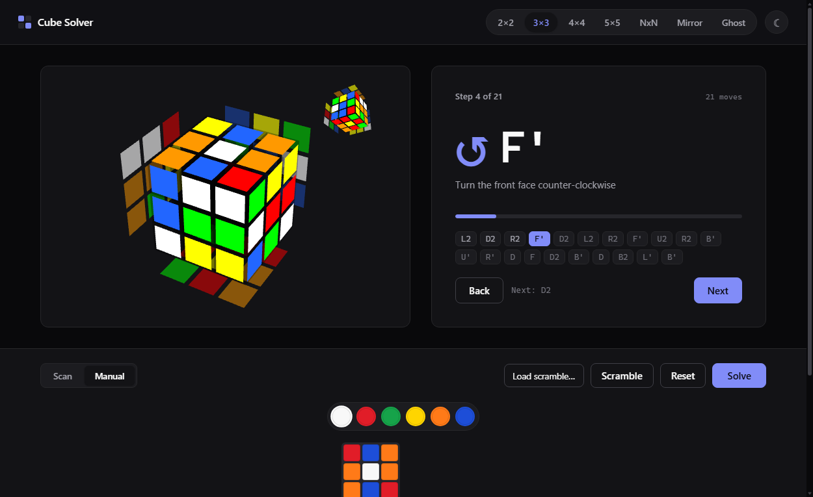

# Cube Solver

A fully client-side web app that scans, solves, and walks you step-by-step
through twisty puzzles — 2×2, 3×3, general NxN, plus mirror and ghost shape-mods.
Everything runs in the browser: **the webcam stream never leaves your device,
there is no backend, and nothing is uploaded.**



## What works today

| Puzzle | Input | Solve | Notes |
| ------ | ----- | ----- | ----- |
| **2×2** | manual / webcam | ✅ | cubing.js 2×2 solver |
| **3×3** | manual / webcam | ✅ | two-phase (`min2phase`), ~20 moves, instant |
| **Mirror / Ghost** | manual only | ✅ | single-color 3×3 shape-mods, solved as a 3×3 |
| **4×4 / 5×5 / NxN** | manual / webcam (odd) | ⚠️ experimental | full reduction not yet wired — input + 3D view work |

The 4×4/5×5/NxN **solver** is honest groundwork: center-solving is implemented
and tested, but the edge-pairing + parity tail of reduction isn't reliable yet,
so big-cube solving is not exposed. You can still build, scan, and preview those
cubes in 3D. See [Known limits](#known-limits).

## How it works

```text
input (camera / manual)  →  normalized facelet state  →  solver  →  3D step playback
```

- **Input** — a guided six-face webcam scan (color cubes) or a click/drag-to-paint
  net editor. Both produce the same normalized, size-agnostic facelet model.
- **Scan classification** — each captured frame is sampled per sticker and
  classified in CIELAB space against the six captured **center** stickers (a
  per-scan white balance), then dropped into the editable grid so you can fix any
  misread before solving.
- **Solve** — dispatched by puzzle:
  - 3×3 (and mirror/ghost) → cubing.js two-phase solver.
  - 2×2 → cubing.js 2×2 solver.
  - The solver consumes a `KPattern` built by our own facelet↔cubie converter
    (cubing.js ships none), cross-validated against cubing.js over hundreds of
    random scrambles.
- **Playback** — the solution animates on a [cubing.js](https://js.cubing.net/)
  `TwistyPlayer`. Each step shows the move in big monospace notation, a
  plain-English cue with a direction arrow, a progress bar, and the full move
  strip. Step with the buttons or the arrow keys (← → Home End).

## Tech

Vite + React 18 + TypeScript · [cubing.js](https://github.com/cubing/cubing.js)
(3D rendering, 2×2/3×3 solvers, puzzle definitions) · zustand · plain CSS Modules ·
Vitest. No UI framework, no backend. Webcam via `getUserMedia` + Canvas (no
OpenCV — classic LAB classification is enough).

## Run / build / test

```bash
npm install      # install dependencies
npm run dev      # dev server (http://localhost:5173)
npm run build    # type-check + static build into dist/
npm run preview  # preview the production build
npm run lint     # lint
npm test         # run the test suite (Vitest)
```

### Deploy

The build is fully static — deploy `dist/` to any static host:

```bash
npm run build
# then serve dist/ — drag it to Netlify, `vercel deploy`, GitHub Pages, etc.
```

## Testing

- **Facelet engine** — group-theory invariants (move orders, wide = outer ∘
  slices), notation round-trips.
- **Facelet ↔ KPattern converters** — cross-validated against cubing.js itself
  over 500 (3×3) / 300 (2×2) random scrambles; the conventions are derived from
  the library, not guessed.
- **Validator** — rejects each illegal state (wrong counts, twisted corner,
  flipped edge, bad permutation parity).
- **Solvers** — end-to-end property tests: scramble → solve → apply → assert
  solved (the cubing.js worker runs under Node).
- **Color classifier** — synthetic samples with per-face lighting + noise; ≥95%
  sticker accuracy, 100% noise-free.
- **Reduction (groundwork)** — 4×4 center-solving on random scrambles.

The UI flows (scan → review, solve → step, theme, NxN picker, responsive) are
verified with a headless-browser driver (`scripts/cdp-drive.mjs`).

## Known limits

- **4×4 / 5×5 / NxN solving is experimental and not yet available.** A fast,
  100%-reliable reduction (centers → edge pairing → 3×3 → OLL/PLL parity) is a
  large piece of work; the center stage is done and tested, but the edge-pairing
  and parity tail isn't reliable, so it isn't wired up. Input and 3D preview work,
  and NxN is capped at 7×7 (the largest cube cubing.js's `TwistyPlayer` renders).
- **Mirror & ghost cubes are manual-entry only** — they're single-color, so a
  camera has no colors to read. You enter the equivalent 3×3 by piece shape.
- **Webcam accuracy depends on lighting.** Classification anchors to the six
  captured centers and is robust in tests, but glare or strong color casts can
  still misread a sticker — every scan lands in the editable grid for correction.
- "Optimal" here means *fast and short* (~20 moves for 3×3 in milliseconds), not
  provably move-optimal.

## Project layout

```text
src/
  state/      facelet model, NxN move engine, zustand store, scramble presets
  input/      manual net editor, scan→review flow, webcam scanner + classifier
  solver/     facelet↔KPattern converters, validation, 2×2/3×3 solvers, dispatch
              reduction/  NxN reduction groundwork (centers tested; edges WIP)
  viz/        TwistyPlayer wrapper (drives setup + step playback)
  playback/   step controller + move-cue translation
  ui/         top bar, cube-type pills + NxN picker, input toggle, theme toggle
docs/         cubing.js API reference (verified against the installed version)
scripts/      one-off KPuzzle calibration + headless verification driver
```

`docs/cubing-api.md` records the exact cubing.js APIs this project depends on,
verified against the installed version. cubing.js's `experimental*` symbols can
be renamed between releases, so usage is funneled through thin wrappers.
